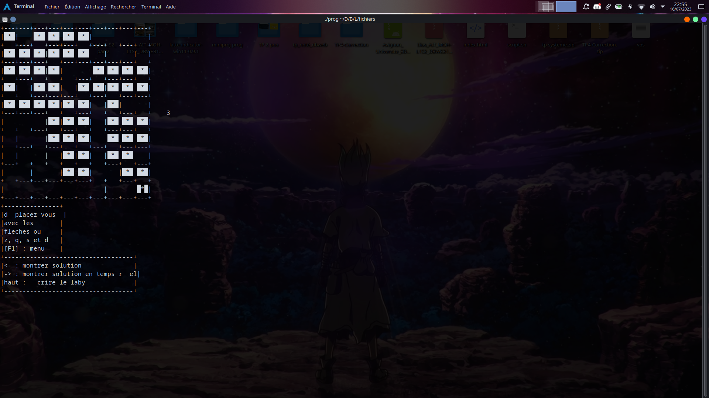

# Perfect Maze Generator

This is a C++ program that generates perfect mazes using the depth-first search algorithm. It utilizes the ncurses library for terminal-based visualization.

## Requirements

To compile and run this program, you need to have the following:

- C++ compiler (supporting C++11 or later)
- ncurses library

## Installation

1. Clone the repository:

   ```bash
   git clone https://github.com/your-username/maze-generator.git
   ```

2. Change to the project directory:

   ```bash
   cd maze-generator
   ```

3. Compile the source files using g++:

   ```bash
   g++ *.cpp -o output -lncurses
   ```

   Make sure to have ncurses installed on your system. If it's not already installed, you can install it using your system's package manager.

## Usage

Once you have compiled the program, you can run it using the following command:

```bash
./output
```

The maze generator will start running, and you will see the maze being generated in the terminal window using ASCII characters. The algorithm will continue until a perfect maze is generated.

## Screenshot



The above screenshot demonstrates the algorithm in action, generating a perfect maze. The green color represents the starting point, and the red color represents the end point of the maze.

## Acknowledgements

This maze generator is based on the depth-first search algorithm. The ncurses library is used for terminal visualization.